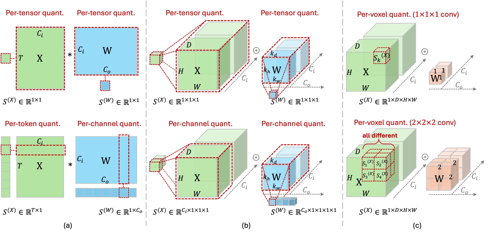

<div align="center">
  
</div>

<h2><p align="center">
  MedQuanBench: Quantization-Aware Analysis for Efficient Medical Imaging Models
</p></h2>


<div align="center">

[](#medquanbench-models)
[](#medquanbench-results)
[](https://arxiv.org/abs/xxxx.xxxxx)
[](https://github.com/Chongyu1117/PTQ4MedSeg/stargazers)

</div>

We introduce **MedQuanBench**, a large-scale and diverse benchmark designed to rigorously evaluate quantization techniques for 3D medical imaging models. Our benchmark spans a wide range of modern architectures (e.g., CNNs and Transformers). We systematically evaluate representative post-training quantization (PTQ) strategies **across model scales and dataset sizes**. Additionally, we perform detailed **sensitivity analyses** to identify which model components are most vulnerable to quantization, including layer-wise degradation and activation distribution shifts. 


## News

- **[2025-09-18]** 🔥 Released — 4-bit simulated quantization code and the [MedFormer checkpoint](#medquanbench-models) are now available, ready to be used in benchmarking.
- **[2025-09-17]** 🚀 Released — 8-bit real quantization code is now available. Check out [MedPTQ](https://github.com/hrlblab/PTQ).  

## Getting Started

- Installation Guide
- Usage Tutorial

## Quantization Granularity 

<div align="center">
  
</div>

**Quantization granularity in MedQuanBench**
- **(a) Quantization schemes for linear layers:**  
  Activation per-tensor and weight per-tensor quantization (top), activation per-token and weight per-channel quantization (bottom). Vector-wise quantization schemes (per-token, per-channel) efficiently utilize low-bit kernels when scaling factors align with outer tensor dimensions (token dimension *T* and output channel dimension *C<sub>o</sub>*).

- **(b) Quantization schemes for convolutional layers:**  
  Activation per-tensor and weight per-tensor quantization (top), activation per-channel and weight per-channel quantization (bottom). Outer tensor dimension alignment (output channel dimension *C<sub>o</sub>*) facilitates efficient low-bit convolutional implementations.

- **(c) Quantization schemes for spatial dimension:**  
  Per-voxel quantization assigns unique scaling factors for each voxel. For kernel size = 1 (top), one scaling factor per voxel is sufficient; for larger kernels (bottom, shown as *2×2×2*), each position within the kernel uses a separate scaling factor.


## MedQuanBench Models

<table>
  <tr>
    <th>Model</th>
    <th>Download</th>
    <th>Dataset</th>
  </tr>

  <tr>
    <td>MedFormer</td>
    <td>
      <a href="https://www.dropbox.com/scl/fi/xxxxxx/medformer_checkpoint.pth?dl=1">
        
      </a>
    </td>
    <td><a href="https://www.synapse.org/Synapse:syn3193805/wiki/89480">BTCV</a></td>
  </tr>
</table>

> [!NOTE]  
> INT8 quantized **U-Net** and **TransUNet** have already been released and are ready for deployment on real GPUs — see [MedPTQ](https://github.com/hrlblab/PTQ).


## MedQuanBench Results
<details>
<summary><b>MedQuanBench results on BTCV test-set</b></summary>

<p>We evaluate multiple 3D medical segmentation models under <b>FP32</b>, <b>INT8</b> (INT W8A8), and <b>INT4</b> (INT W4A4) post-training quantization.<br/>
Three granularity schemes are compared:<br/>
1. <i>Per-tensor</i> — a single scale for activations and weights in each layer<br/>
2. <i>Per-channel/token</i> — separate scales for each convolutional input channel or transformer token, with all weights quantized per channel<br/>
3. <i>Adaptive stratification</i> — per-voxel scaling for 1×1×1 convolutions, and per-channel/token scaling elsewhere
</p>

<p>
INT8 quantization consistently preserves full-precision accuracy. In contrast, INT4 performance varies depending on model architecture and quantization granularity: <b>hybrid models are particularly sensitive under per-tensor quantization, while CNNs degrade more gradually</b>. Reported DSC and NSD values are shown along with relative drop (↓Δ%) from the FP32 baseline.
</p>

<table>
  <thead>
    <tr>
      <th>Framework</th>
      <th>Architecture</th>
      <th>Category</th>
      <th>Param</th>
      <th>Precision</th>
      <th>Quant-Granularity</th>
      <th>DSC (↓Δ%)</th>
      <th>NSD (↓Δ%)</th>
    </tr>
  </thead>
  <tbody>
    <tr>
      <td rowspan="28">nnUNet</td>
      <td rowspan="7">nnU-Net</td>
      <td rowspan="7">CNN</td>
      <td rowspan="7">26.9&nbsp;M</td>
      <td>FP32</td><td>--</td><td>0.872 (--)</td><td>0.888 (--)</td>
    </tr>
    <tr><td>INT W8A8</td><td>Per-channel</td><td>0.870 (0.2%)</td><td>0.887 (0.1%)</td></tr>
    <tr><td>INT W8A8</td><td>Per-tensor</td><td>0.870 (0.2%)</td><td>0.888 (0)</td></tr>
    <tr><td>INT W8A8</td><td>Adaptive stratification</td><td>0.870 (0.2%)</td><td>0.887 (0.1%)</td></tr>
    <tr><td>INT W4A4</td><td>Per-channel</td><td>0.387 (55.6%)</td><td>0.354 (60.1%)</td></tr>
    <tr><td>INT W4A4</td><td>Per-tensor</td><td>0.170 (80.5%)</td><td>0.169 (80.9%)</td></tr>
    <tr><td>INT W4A4</td><td>Adaptive stratification</td><td>0.393 (54.9%)</td><td>0.358 (59.7%)</td></tr>
    <tr>
      <td rowspan="7">STU-Net-B</td>
      <td rowspan="7">CNN</td>
      <td rowspan="7">58.3&nbsp;M</td>
      <td>FP32</td><td>--</td><td>0.881 (--)</td><td>0.903 (--)</td>
    </tr>
    <tr><td>INT W8A8</td><td>Per-channel</td><td>0.881 (0)</td><td>0.901 (0.2%)</td></tr>
    <tr><td>INT W8A8</td><td>Per-tensor</td><td>0.881 (0)</td><td>0.902 (0.1%)</td></tr>
    <tr><td>INT W8A8</td><td>Adaptive stratification</td><td>0.881 (0)</td><td>0.902 (0.1%)</td></tr>
    <tr><td>INT W4A4</td><td>Per-channel</td><td>0.647 (26.6%)</td><td>0.619 (31.5%)</td></tr>
    <tr><td>INT W4A4</td><td>Per-tensor</td><td>0.654 (25.8%)</td><td>0.636 (29.6%)</td></tr>
    <tr><td>INT W4A4</td><td>Adaptive stratification</td><td>0.829 (5.9%)</td><td>0.833 (7.8%)</td></tr>
    <tr>
      <td rowspan="7">STU-Net-L</td>
      <td rowspan="7">CNN</td>
      <td rowspan="7">440.3&nbsp;M</td>
      <td>FP32</td><td>--</td><td>0.880 (--)</td><td>0.903 (--)</td>
    </tr>
    <tr><td>INT W8A8</td><td>Per-channel</td><td>0.880 (0)</td><td>0.902 (0.1%)</td></tr>
    <tr><td>INT W8A8</td><td>Per-tensor</td><td>0.880 (0)</td><td>0.903 (0)</td></tr>
    <tr><td>INT W8A8</td><td>Adaptive stratification</td><td>0.880 (0)</td><td>0.902 (0.1%)</td></tr>
    <tr><td>INT W4A4</td><td>Per-channel</td><td>0.701 (20.3%)</td><td>0.695 (23.0%)</td></tr>
    <tr><td>INT W4A4</td><td>Per-tensor</td><td>0.466 (47.0%)</td><td>0.460 (49.1%)</td></tr>
    <tr><td>INT W4A4</td><td>Adaptive stratification</td><td>0.857 (2.6%)</td><td>0.870 (3.7%)</td></tr>
    <tr>
      <td rowspan="7">STU-Net-H</td>
      <td rowspan="7">CNN</td>
      <td rowspan="7">1,457.3&nbsp;M</td>
      <td>FP32</td><td>--</td><td>0.873 (--)</td><td>0.889 (--)</td>
    </tr>
    <tr><td>INT W8A8</td><td>Per-channel</td><td>0.873 (0)</td><td>0.889 (0)</td></tr>
    <tr><td>INT W8A8</td><td>Per-tensor</td><td>0.872 (0.1%)</td><td>0.889 (0)</td></tr>
    <tr><td>INT W8A8</td><td>Adaptive stratification</td><td>0.872 (0.1%)</td><td>0.889 (0)</td></tr>
    <tr><td>INT W4A4</td><td>Per-channel</td><td>0.700 (19.8%)</td><td>0.681 (23.4%)</td></tr>
    <tr><td>INT W4A4</td><td>Per-tensor</td><td>0.734 (15.9%)</td><td>0.716 (19.5%)</td></tr>
    <tr><td>INT W4A4</td><td>Adaptive stratification</td><td>0.840 (3.8%)</td><td>0.848 (4.6%)</td></tr>
    <tr>
      <td rowspan="14">MONAI</td>
      <td rowspan="7">SwinUNETR</td>
      <td rowspan="7">Hybrid</td>
      <td rowspan="7">58.5&nbsp;M</td>
      <td>FP32</td><td>--</td><td>0.849 (--)</td><td>0.760 (--)</td>
    </tr>
    <tr><td>INT W8A8</td><td>Per-channel/token</td><td>0.849 (0)</td><td>0.761 (1%↑)</td></tr>
    <tr><td>INT W8A8</td><td>Per-tensor</td><td>0.849 (0)</td><td>0.761 (1%↑)</td></tr>
    <tr><td>INT W8A8</td><td>Adaptive stratification</td><td>0.849 (0)</td><td>0.761 (1%↑)</td></tr>
    <tr><td>INT W4A4</td><td>Per-channel/token</td><td>0.565 (33.5%)</td><td>0.446 (41.3%)</td></tr>
    <tr><td>INT W4A4</td><td>Per-tensor</td><td>0.059 (93.1%)</td><td>0.054 (92.9%)</td></tr>
    <tr><td>INT W4A4</td><td>Adaptive stratification</td><td>0.571 (32.7%)</td><td>0.447 (41.2%)</td></tr>
    <tr>
      <td rowspan="7">UNETR</td>
      <td rowspan="7">Hybrid</td>
      <td rowspan="7">92.4&nbsp;M</td>
      <td>FP32</td><td>--</td><td>0.824 (--)</td><td>0.714 (--)</td>
    </tr>
    <tr><td>INT W8A8</td><td>Per-channel/token</td><td>0.824 (0)</td><td>0.714 (0)</td></tr>
    <tr><td>INT W8A8</td><td>Per-tensor</td><td>0.802 (2.7%)</td><td>0.669 (6.3%)</td></tr>
    <tr><td>INT W8A8</td><td>Adaptive stratification</td><td>0.809 (1.8%)</td><td>0.676 (5.3%)</td></tr>
    <tr><td>INT W4A4</td><td>Per-channel/token</td><td>0.553 (35.3%)</td><td>0.366 (48.7%)</td></tr>
    <tr><td>INT W4A4</td><td>Per-tensor</td><td>0.004 (99.5%)</td><td>0.004 (94.4%)</td></tr>
    <tr><td>INT W4A4</td><td>Adaptive stratification</td><td>0.590 (28.4%)</td><td>0.386 (45.9%)</td></tr>
    <tr>
      <td rowspan="7">MedFormer</td>
      <td rowspan="7">MedFormer</td>
      <td rowspan="7">Hybrid</td>
      <td rowspan="7">36.6&nbsp;M</td>
      <td>FP32</td><td>--</td><td>0.882 (--)</td><td>0.826 (--)</td>
    </tr>
    <tr><td>INT W8A8</td><td>Per-channel/token</td><td>0.882 (0)</td><td>0.826 (0)</td></tr>
    <tr><td>INT W8A8</td><td>Per-tensor</td><td>0.880 (0.2%)</td><td>0.823 (0.3%)</td></tr>
    <tr><td>INT W8A8</td><td>Adaptive stratification</td><td>0.882 (0)</td><td>0.826 (0)</td></tr>
    <tr><td>INT W4A4</td><td>Per-channel/token</td><td>0.654 (25.9%)</td><td>0.462 (44.1%)</td></tr>
    <tr><td>INT W4A4</td><td>Per-tensor</td><td>0.000 (100%)</td><td>0.000 (100%)</td></tr>
    <tr><td>INT W4A4</td><td>Adaptive stratification</td><td>0.719 (18.5%)</td><td>0.610 (26.3%)</td></tr>

  </tbody>
</table>
</details>


<details>
<summary><b>Quantization results across model scales on BTCV</b></summary>

<p>
We evaluate STU-Net (Base/Large/Huge) and SwinUNETR (Tiny/Small/Base) models with increasing parameter sizes to assess whether model scale influences quantization robustness. 
Across all models, <b>INT8 quantization</b> maintains segmentation performance nearly identical to the FP32 baseline. 
However, the sensitivity to <b>INT4 quantization</b> does not show a consistent trend with model size: larger models are not strictly more or less robust. 
Instead, quantization granularity emerges as a more reliable factor, as <i>adaptive stratification</i> consistently improves performance over lower-granularity schemes, highlighting its importance in achieving accurate low-bit deployment in medical imaging.
</p>

<table>
  <thead>
    <tr>
      <th>Framework</th>
      <th>Architecture</th>
      <th>Category</th>
      <th>Param</th>
      <th>Precision</th>
      <th>Quant-Granularity</th>
      <th>DSC (↓Δ%)</th>
      <th>NSD (↓Δ%)</th>
    </tr>
  </thead>
  <tbody>
    <tr>
      <td rowspan="21">nnUNet</td>
      <td rowspan="7">STU-Net-B</td>
      <td rowspan="7">CNN</td>
      <td rowspan="7">58.3 M</td>
      <td>FP32</td><td>--</td><td>0.881 (--)</td><td>0.903 (--)</td>
    </tr>
    <tr><td>INT W8A8</td><td>Per-channel</td><td>0.881 (0)</td><td>0.901 (0.2%)</td></tr>
    <tr><td>INT W8A8</td><td>Per-tensor</td><td>0.881 (0)</td><td>0.902 (0.1%)</td></tr>
    <tr><td>INT W8A8</td><td>Adaptive strat.</td><td>0.881 (0)</td><td>0.902 (0.1%)</td></tr>
    <tr><td>INT W4A4</td><td>Per-channel</td><td>0.647 (26.6%)</td><td>0.619 (31.5%)</td></tr>
    <tr><td>INT W4A4</td><td>Per-tensor</td><td>0.654 (25.8%)</td><td>0.636 (29.6%)</td></tr>
    <tr><td>INT W4A4</td><td>Adaptive strat.</td><td>0.829 (5.9%)</td><td>0.833 (7.8%)</td></tr>
    <tr>
      <td rowspan="7">STU-Net-L</td>
      <td rowspan="7">CNN</td>
      <td rowspan="7">440.3 M</td>
      <td>FP32</td><td>--</td><td>0.880 (--)</td><td>0.903 (--)</td>
    </tr>
    <tr><td>INT W8A8</td><td>Per-channel</td><td>0.880 (0)</td><td>0.902 (0.1%)</td></tr>
    <tr><td>INT W8A8</td><td>Per-tensor</td><td>0.880 (0)</td><td>0.903 (0)</td></tr>
    <tr><td>INT W8A8</td><td>Adaptive strat.</td><td>0.880 (0)</td><td>0.902 (0.1%)</td></tr>
    <tr><td>INT W4A4</td><td>Per-channel</td><td>0.701 (20.3%)</td><td>0.695 (23.0%)</td></tr>
    <tr><td>INT W4A4</td><td>Per-tensor</td><td>0.466 (47.0%)</td><td>0.460 (49.1%)</td></tr>
    <tr><td>INT W4A4</td><td>Adaptive strat.</td><td>0.857 (2.6%)</td><td>0.870 (3.7%)</td></tr>
    <tr>
      <td rowspan="7">STU-Net-H</td>
      <td rowspan="7">CNN</td>
      <td rowspan="7">1,457.3 M</td>
      <td>FP32</td><td>--</td><td>0.873 (--)</td><td>0.889 (--)</td>
    </tr>
    <tr><td>INT W8A8</td><td>Per-channel</td><td>0.873 (0)</td><td>0.889 (0)</td></tr>
    <tr><td>INT W8A8</td><td>Per-tensor</td><td>0.872 (0.1%)</td><td>0.889 (0)</td></tr>
    <tr><td>INT W8A8</td><td>Adaptive strat.</td><td>0.872 (0.1%)</td><td>0.889 (0)</td></tr>
    <tr><td>INT W4A4</td><td>Per-channel</td><td>0.700 (19.8%)</td><td>0.681 (23.4%)</td></tr>
    <tr><td>INT W4A4</td><td>Per-tensor</td><td>0.734 (15.9%)</td><td>0.716 (19.5%)</td></tr>
    <tr><td>INT W4A4</td><td>Adaptive strat.</td><td>0.840 (3.8%)</td><td>0.848 (4.6%)</td></tr>
    <tr>
      <td rowspan="21">MONAI</td>
      <td rowspan="7">SwinUNETR-T</td>
      <td rowspan="7">Hybrid</td>
      <td rowspan="7">4.1 M</td>
      <td>FP32</td><td>--</td><td>0.684 (--)</td><td>0.586 (--)</td>
    </tr>
    <tr><td>INT W8A8</td><td>Per-channel/token</td><td>0.682 (0.3%)</td><td>0.583 (0.5%)</td></tr>
    <tr><td>INT W8A8</td><td>Per-tensor</td><td>0.679 (0.7%)</td><td>0.578 (1.4%)</td></tr>
    <tr><td>INT W8A8</td><td>Adaptive strat.</td><td>0.683 (0.1%)</td><td>0.584 (0.3%)</td></tr>
    <tr><td>INT W4A4</td><td>Per-channel/token</td><td>0.328 (52.0%)</td><td>0.154 (73.7%)</td></tr>
    <tr><td>INT W4A4</td><td>Per-tensor</td><td>0.019 (97.2%)</td><td>0.010 (98.3%)</td></tr>
    <tr><td>INT W4A4</td><td>Adaptive strat.</td><td>0.347 (49.2%)</td><td>0.169 (71.2%)</td></tr>
    <tr>
      <td rowspan="7">SwinUNETR-S</td>
      <td rowspan="7">Hybrid</td>
      <td rowspan="7">15.7 M</td>
      <td>FP32</td><td>--</td><td>0.788 (--)</td><td>0.713 (--)</td>
    </tr>
    <tr><td>INT W8A8</td><td>Per-channel/token</td><td>0.787 (0.1%)</td><td>0.712 (0.1%)</td></tr>
    <tr><td>INT W8A8</td><td>Per-tensor</td><td>0.783 (0.6%)</td><td>0.704 (1.2%)</td></tr>
    <tr><td>INT W8A8</td><td>Adaptive strat.</td><td>0.787 (0.1%)</td><td>0.713 (0)</td></tr>
    <tr><td>INT W4A4</td><td>Per-channel/token</td><td>0.450 (42.9%)</td><td>0.324 (54.5%)</td></tr>
    <tr><td>INT W4A4</td><td>Per-tensor</td><td>0.012 (98.5%)</td><td>0.011 (98.4%)</td></tr>
    <tr><td>INT W4A4</td><td>Adaptive strat.</td><td>0.494 (37.3%)</td><td>0.371 (48.0%)</td></tr>
    <tr>
      <td rowspan="7">SwinUNETR-B</td>
      <td rowspan="7">Hybrid</td>
      <td rowspan="7">62.2 M</td>
      <td>FP32</td><td>--</td><td>0.804 (--)</td><td>0.746 (--)</td>
    </tr>
    <tr><td>INT W8A8</td><td>Per-channel/token</td><td>0.803 (0.1%)</td><td>0.744 (0.3%)</td></tr>
    <tr><td>INT W8A8</td><td>Per-tensor</td><td>0.802 (0.2%)</td><td>0.740 (0.8%)</td></tr>
    <tr><td>INT W8A8</td><td>Adaptive strat.</td><td>0.804 (0)</td><td>0.745 (0.1%)</td></tr>
    <tr><td>INT W4A4</td><td>Per-channel/token</td><td>0.380 (52.7%)</td><td>0.286 (61.7%)</td></tr>
    <tr><td>INT W4A4</td><td>Per-tensor</td><td>0.002 (99.8%)</td><td>0.004 (99.5%)</td></tr>
    <tr><td>INT W4A4</td><td>Adaptive strat.</td><td>0.378 (53.0%)</td><td>0.289 (61.2%)</td></tr>

  </tbody>
</table>

</details>


<details> <summary><b>Quantization results across modalities and dataset scales</b></summary> <p> This table evaluates the quantization robustness of <b>UNesT</b> and <b>SwinUNETR</b> across datasets varying in imaging modality, class numbers, and scale. BTCV and AbdomenAtlas 2.0 are abdominal <b>CT</b> segmentation datasets, while WholeBrain involves <b>MRI</b>. As dataset size and class count increase, models show greater sensitivity to <b>INT4</b>; finer granularity (e.g., <i>Adaptive stratification</i>) helps mitigate degradation. </p> <table> <thead> <tr> <th>Architecture</th> <th>Category</th> <th>Param</th> <th>Dataset</th> <th>Precision</th> <th>Quant-Granularity</th> <th>DSC (↓Δ%)</th> <th>NSD (↓Δ%)</th> </tr> </thead> <tbody>
<tr>
  <td rowspan="14">UNesT</td>
  <td rowspan="14">Hybrid</td>
  <td rowspan="14">87.3 M</td>
  <td rowspan="7">BTCV</td>
  <td>FP32</td><td>--</td><td>0.783 (--)</td><td>0.704 (--)</td>
</tr>
<tr><td>INT W8A8</td><td>Per-channel/token</td><td>0.783 (0)</td><td>0.704 (0)</td></tr>
<tr><td>INT W8A8</td><td>Per-tensor</td><td>0.783 (0)</td><td>0.702 (0.3%)</td></tr>
<tr><td>INT W8A8</td><td>Adaptive stratification</td><td>0.783 (0)</td><td>0.704 (0)</td></tr>
<tr><td>INT W4A4</td><td>Per-channel/token</td><td>0.716 (8.6%)</td><td>0.615 (12.6%)</td></tr>
<tr><td>INT W4A4</td><td>Per-tensor</td><td>0.111 (85.8%)</td><td>0.064 (90.9%)</td></tr>
<tr><td>INT W4A4</td><td>Adaptive stratification</td><td>0.721 (7.9%)</td><td>0.618 (12.2%)</td></tr>
<tr>
  <td rowspan="7">WholeBrain</td>
  <td>FP32</td><td>--</td><td>0.893 (--)</td><td>0.961 (--)</td>
</tr>
<tr><td>INT W8A8</td><td>Per-channel/token</td><td>0.893 (0)</td><td>0.961 (0)</td></tr>
<tr><td>INT W8A8</td><td>Per-tensor</td><td>0.887 (0.6%)</td><td>0.959 (0.2%)</td></tr>
<tr><td>INT W8A8</td><td>Adaptive stratification</td><td>0.893 (0)</td><td>0.961 (0)</td></tr>
<tr><td>INT W4A4</td><td>Per-channel/token</td><td>0.697 (21.9%)</td><td>0.664 (30.9%)</td></tr>
<tr><td>INT W4A4</td><td>Per-tensor</td><td>0.019 (97.8%)</td><td>0.034 (96.5%)</td></tr>
<tr><td>INT W4A4</td><td>Adaptive stratification</td><td>0.753 (15.7%)</td><td>0.741 (22.9%)</td></tr>
<tr>
  <td rowspan="14">SwinUNETR</td>
  <td rowspan="14">Hybrid</td>
  <td rowspan="14">62.2 M</td>
  <td rowspan="7">AbdomenAtlas 2.0</td>
  <td>FP32</td><td>--</td><td>0.780 (--)</td><td>0.742 (--)</td>
</tr>
<tr><td>INT W8A8</td><td>Per-channel/token</td><td>0.779 (0.1%)</td><td>0.741 (0.1%)</td></tr>
<tr><td>INT W8A8</td><td>Per-tensor</td><td>0.773 (0.9%)</td><td>0.731 (1.5%)</td></tr>
<tr><td>INT W8A8</td><td>Adaptive stratification</td><td>0.779 (0.1%)</td><td>0.741 (0.1%)</td></tr>
<tr><td>INT W4A4</td><td>Per-channel/token</td><td>0.179 (77.1%)</td><td>0.112 (84.9%)</td></tr>
<tr><td>INT W4A4</td><td>Per-tensor</td><td>0.006 (99.2%)</td><td>0.004 (99.5%)</td></tr>
<tr><td>INT W4A4</td><td>Adaptive stratification</td><td>0.194 (75.1%)</td><td>0.119 (83.9%)</td></tr>
<tr>
  <td rowspan="7">BTCV</td>
  <td>FP32</td><td>--</td><td>0.804 (--)</td><td>0.746 (--)</td>
</tr>
<tr><td>INT W8A8</td><td>Per-channel/token</td><td>0.803 (0.1%)</td><td>0.744 (0.3%)</td></tr>
<tr><td>INT W8A8</td><td>Per-tensor</td><td>0.802 (0.2%)</td><td>0.740 (0.8%)</td></tr>
<tr><td>INT W8A8</td><td>Adaptive stratification</td><td>0.804 (0)</td><td>0.745 (0.1%)</td></tr>
<tr><td>INT W4A4</td><td>Per-channel/token</td><td>0.380 (52.7%)</td><td>0.286 (61.7%)</td></tr>
<tr><td>INT W4A4</td><td>Per-tensor</td><td>0.002 (99.8%)</td><td>0.004 (99.5%)</td></tr>
<tr><td>INT W4A4</td><td>Adaptive stratification</td><td>0.378 (53.0%)</td><td>0.289 (61.2%)</td></tr>
</tbody> </table> </details>

## Citation

If you find **MedQuanBench** useful, please cite:

```bibtex
@article{qu2025post,
  title={Post-Training Quantization for 3D Medical Image Segmentation: A Practical Study on Real Inference Engines},
  author={Qu, Chongyu and Zhao, Ritchie and Yu, Ye and Liu, Bin and Yao, Tianyuan and Zhu, Junchao and Landman, Bennett A and Tang, Yucheng and Huo, Yuankai},
  journal={arXiv preprint arXiv:2501.17343},
  year={2025}
}
```

## Acknowledgments

