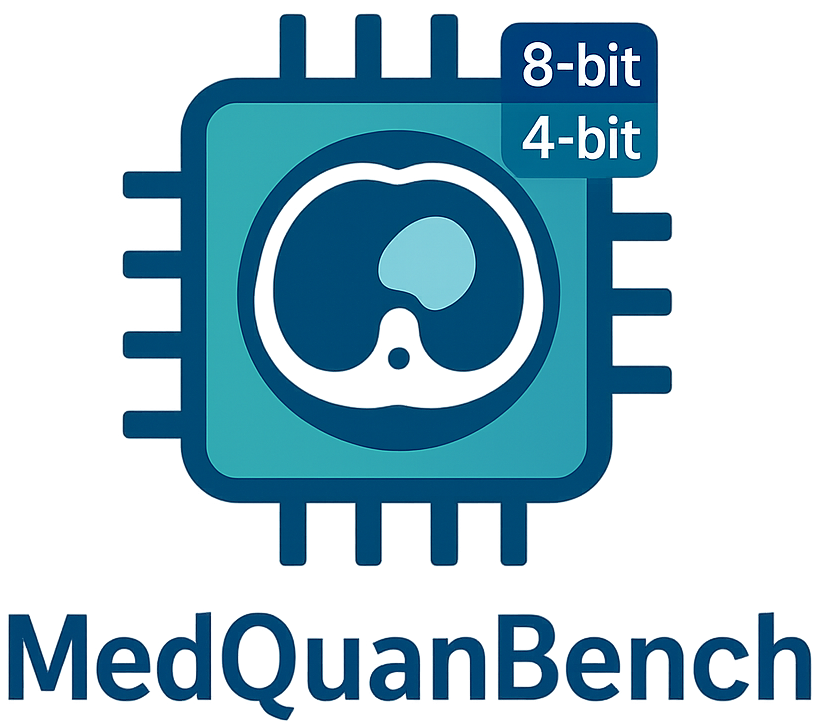

  

<h2>

  MedQuanBench: Quantization-Aware Analysis for Efficient Medical Imaging Models

</h2>

We introduce **MedQuanBench**, a large-scale and diverse benchmark designed to rigorously evaluate quantization techniques for 3D medical imaging models. Our benchmark spans a wide range of modern architectures (e.g., CNNs and Transformers). We systematically evaluate representative post-training quantization (PTQ) strategies **across model scales and dataset sizes**. Additionally, we perform detailed **sensitivity analyses** to identify which model components are most vulnerable to quantization, including layer-wise degradation and activation distribution shifts. 

## News

- **[2025-09-18]** 🔥 Released — 4-bit simulated quantization code and the [MedFormer checkpoint](#medquanbench-models) are now available, ready to be used in benchmarking.
- **[2025-09-17]** 🚀 Released — 8-bit real quantization code is now available. Check out [MedPTQ](https://github.com/hrlblab/PTQ).  

## Getting Started

- Installation Guide
- Usage Tutorial

## Quantization Granularity 

  

**Quantization granularity in MedQuanBench**
- **(a) Quantization schemes for linear layers:**  
  Activation per-tensor and weight per-tensor quantization (top), activation per-token and weight per-channel quantization (bottom). Vector-wise quantization schemes (per-token, per-channel) efficiently utilize low-bit kernels when scaling factors align with outer tensor dimensions (token dimension *T* and output channel dimension *Co*).

- **(b) Quantization schemes for convolutional layers:**  
  Activation per-tensor and weight per-tensor quantization (top), activation per-channel and weight per-channel quantization (bottom). Outer tensor dimension alignment (output channel dimension *Co*) facilitates efficient low-bit convolutional implementations.

- **(c) Quantization schemes for spatial dimension:**  
  Per-voxel quantization assigns unique scaling factors for each voxel. For kernel size = 1 (top), one scaling factor per voxel is sufficient; for larger kernels (bottom, shown as *2×2×2*), each position within the kernel uses a separate scaling factor.

## MedQuanBench Models

<table>
  <tr>
    <th>Model</th>
    <th>Download</th>
    <th>Dataset</th>
  </tr>

  <tr>
    <td>MedFormer</td>
    <td>
      
    </td>
    <td><a href="https://www.synapse.org/Synapse:syn3193805/wiki/89480">BTCV</a></td>
  </tr>
</table>

> [!NOTE]  
> INT8 quantized **U-Net** and **TransUNet** have already been released and are ready for deployment on real GPUs — see [MedPTQ](https://github.com/hrlblab/PTQ).

## MedQuanBench Results

<b>MedQuanBench results on BTCV test-set</b>

We evaluate multiple 3D medical segmentation models under <b>FP32</b>, <b>INT8</b>, and <b>INT4</b> post-training quantization.  
Three granularity schemes are compared:  
1. <i>Per-tensor</i> — a single scale for activations and weights in each layer  
2. <i>Per-channel/token</i> — separate scales for each convolutional input channel or transformer token, with all weights quantized per channel  
3. <i>Adaptive stratification</i> — per-voxel scaling for 1×1×1 convolutions, and per-channel/token scaling elsewhere

INT8 quantization consistently preserves full-precision accuracy. In contrast, INT4 performance varies depending on model architecture and quantization granularity: <b>hybrid models are particularly sensitive under per-tensor quantization, while CNNs degrade more gradually</b>. Reported DSC and NSD values are shown along with relative drop (↓Δ%) from the FP32 baseline.

---

<table>
  <thead>
    <tr>
      <th>Framework</th>
      <th>Architecture</th>
      <th>Category</th>
      <th>Param</th>
      <th>Precision</th>
      <th>Granularity</th>
      <th>DSC (↓Δ%)</th>
      <th>NSD (↓Δ%)</th>
    </tr>
  </thead>

  <tbody>
    <!-- ==================== nnUNet / nnU-Net ==================== -->
    <tr>
      <td rowspan="35">nnUNet</td>
      <td rowspan="9">nnU-Net</td>
      <td rowspan="9">CNN</td>
      <td rowspan="9">26.9M</td>
      <td>FP32</td><td>--</td><td>0.872 (--)</td><td>0.888 (--)</td>
    </tr>
    <tr><td rowspan="3">INT8</td><td>Per-channel</td><td>0.870 (0.2%)</td><td>0.887 (0.1%)</td></tr>
    <tr><td>Per-tensor</td><td>0.870 (0.2%)</td><td>0.888 (0)</td></tr>
    <tr><td>Adaptive strat.</td><td>0.870 (0.2%)</td><td>0.887 (0.1%)</td></tr>
    <tr><td rowspan="3">INT4</td><td>Per-channel</td><td>0.387 (55.6%)</td><td>0.354 (60.1%)</td></tr>
    <tr><td>Per-tensor</td><td>0.170 (80.5%)</td><td>0.169 (80.9%)</td></tr>
    <tr><td>Adaptive strat.</td><td>0.393 (54.9%)</td><td>0.358 (59.7%)</td></tr>

  </tbody>
</table>

